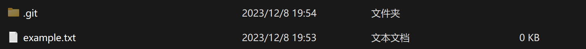

# 2.1 Git 基础- 获取Git 仓库

## 获取Git 仓库

* 将尚未进行版本控制的本地目录转换成Git仓库。
* 从其它服务器**克隆**一个已存在的Git仓库。

## 在已存在目录中初始化仓库

* 在Linux 上

```console
$ cd /home/user/my_project
```

* 在macOS上

```console
$ cd /Users/user/my_project
```

* 在windows上

```console
$ cd /c/user/my_project
```

定位了之后就可以开始初始化Git仓库中所有的必须文件，这些文件是Git仓库的骨干

`git init`(这时只是做了一个初始化操作，你的项目中的文件还没有被跟踪)

* 提交文件

`git add example.txt  # 将 example.txt 添加到暂存区`（暂存区是在这个git文件夹里面的）

`git commit -m "Initial commit"  # 提交更改到仓库，添加一条描述信息`

## 克隆现有的仓库

目的：拷贝一份已经存在了的Git仓库的拷贝，比如说我想要给某个开源项目贡献自己的一份力量，这时就要用到`git clone`命令

此时默认配置下远程Git仓库中的每个文件的每一个版本都将被拉去下来。

`git clone <url>`

例如：要克隆Gir链接库`libgit2`

```console
$ git clone https://github.com/libgit2/libgit2
```

另外如果想要自定义本地仓库的名字，可以通过额外的参数指定新的目录名：

```console
$ git clone https://github.com/libgit2/libgit2 mylibgit
```

> Git 支持多种数据传输协议。 上面的例子使用的是 `https://` 协议，不过你也可以使用 `git://` 协议或者使用 SSH 传输协议，比如 `user@server:path/to/repo.git` 。 [在服务器上搭建 Git](https://git-scm.com/book/zh/v2/ch00/_getting_git_on_a_server) 将会介绍所有这些协议在服务器端如何配置使用，以及各种方式之间的利弊

