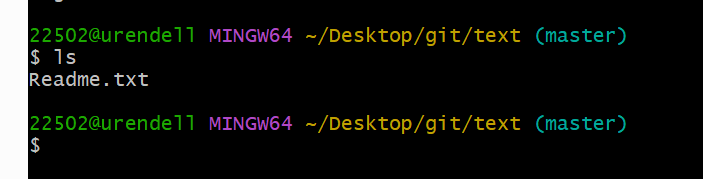
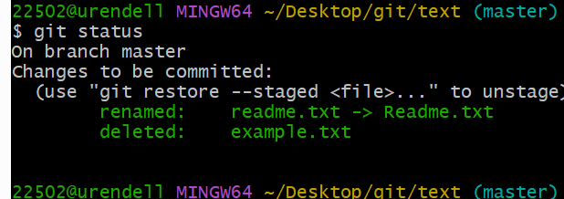

# 2.2 Git 基础——记录每次更新到仓库

文件的状态：**已跟踪，未跟踪**

## 已跟踪

指那些被纳入了版本控制点文件，在上一次快照中有它们的记录，在工作一段时间后，它们的状态可能是未修改，已修改或已放入暂存区。简而言之，已跟踪的文件就是Git已经知道的文件。

## 未跟踪

即不存在上次快照的记录中，也没有放入暂存区。初次克隆某个仓库的时候，工作目录中的所有文件都属于已跟踪文件，并未处于未修改状态，因为Git刚刚检测出它们。


> 编辑过某些文件之后，由于自上次提交后你对它们做了修改，Git 将它们标记为已修改文件。 在工作时，你可以选择性地将这些修改过的文件放入暂存区，然后提交所有已暂存的修改，如此反复。
>
> 

## 跟踪新文件

首先在文件夹下创建一个新文件`readme.txt`

然后输入指令`git status`,查看目前工作文件夹的情况


这里显示`readme.txt`文件处于未跟踪状态

我们可以通过指令去命令去跟踪这个文件`git add readme.txt`

再输入指令 `git status`


## 暂存已修改的文件

对`readme.txt`文件进行修改，然后查看bash命令中的情况

修改了的样子：


添加`git add readme.txt`


## 状态简览

Git的一个选项帮助缩短状态命令的输出，进行简洁的查看

`git status -s`

`git status --short`


> 新添加的未跟踪文件前面有 `??` 标记，新添加到暂存区中的文件前面有 `A` 标记，修改过的文件前面有 `M` 标记。 输出中有两栏，左栏指明了暂存区的状态，右栏指明了工作区的状态。例如，上面的状态报告显示： `README` 文件在工作区已修改但尚未暂存，而 `lib/simplegit.rb` 文件已修改且已暂存。 `Rakefile` 文件已修改，暂存后又作了修改，因此该文件的修改中既有已暂存的部分，又有未暂存的部分。

## 忽略文件

问题：有些文件无需纳入Git 管理，也不希望出现在未跟踪文件列表。比如说自动生成的文件，日志文件，或者编译过程中创建的临时文件

方法：创建一个名为`.gitignore`的文件，列出要忽略的文件的模式。

文件`.gitignore`的格式规范如下：

* 所有空行或者以#开头的行都会被Git忽略
* 可以使用标准的glob模式匹配，它会递归地应用在整个工作区中。
* 匹配模式可以以（/)开头防止递归
* 匹配模式可以以（/)结尾指定目录
* 要忽略指定模式意外的文件或目录，可以在模式前加上叹号（！）取反

### 什么是`glob`?

* shell所用的简化的正则表达式。星号`(*)`匹配零个或多个任意字符；
* `[abc]`匹配任何一个列在方括号中的字符；
* 问号`（？）`只匹配一个任意字符；
* 如果在方括号中使用短划线分隔两个字符，表示所有在这两个字符范围内的都可以匹配；
* 使用两个** 表示匹配任意中间目录，比如`a/**/z` 可以匹配`a/z 、a/b/z、或者a/b/c/z`

```
# 忽略所有的 .a 文件
*.a

# 但跟踪所有的 lib.a，即便你在前面忽略了 .a 文件
!lib.a

# 只忽略当前目录下的 TODO 文件，而不忽略 subdir/TODO
/TODO

# 忽略任何目录下名为 build 的文件夹
build/

# 忽略 doc/notes.txt，但不忽略 doc/server/arch.txt
doc/*.txt

# 忽略 doc/ 目录及其所有子目录下的 .pdf 文件
doc/**/*.pdf
```

| Tip  | GitHub 有一个十分详细的针对数十种项目及语言的 `.gitignore` 文件列表， 你可以在 https://github.com/github/gitignore 找到它。 |
| ---- | ------------------------------------------------------------ |
|      |                                                              |

| Note | 在最简单的情况下，一个仓库可能只根目录下有一个 `.gitignore` 文件，它递归地应用到整个仓库中。 然而，子目录下也可以有额外的 `.gitignore` 文件。子目录中的 `.gitignore` 文件中的规则只作用于它所在的目录中。 （Linux 内核的源码库拥有 206 个 `.gitignore` 文件。）多个 `.gitignore` 文件的具体细节超出了本书的范围，更多详情见 `man gitignore` 。 |
| ---- | ------------------------------------------------------------ |
|      |                                                              |

## 查看已暂存和未暂存的修改

问题：`git status` 输出简陋，可以用`git diff`

问题：当前做的哪些更新尚未暂存？

问题：有哪些更新已暂存并准备好下次提交？

`git diff`


此命令比较的是工作目录中当前文件和暂存区域快照之间的差异。也就是修改之后还没有暂存起来的变化内容。

`-`表示是老版本，+表示是新版本

若要查看已暂存的将要添加到下次提交的内容，可以用`git diff --staged`命令，这将比对已暂存文件与最后一次提交的文件的差异：

> 问题：为什么`git diff` 运行后什么都不返回
>
> 原因：请注意，`git diff` 本身只显示尚未暂存的改动，而不是自上次提交以来所做的所有改动。 所以有时候你一下子暂存了所有更新过的文件，运行 `git diff` 后却什么也没有，就是这个原因。

| Note | Git Diff 的插件版本在本书中，我们使用 `git diff` 来分析文件差异。 但是你也可以使用图形化的工具或外部 diff 工具来比较差异。 可以使用 `git difftool` 命令来调用 emerge 或 vimdiff 等软件（包括商业软件）输出 diff 的分析结果。 使用 `git difftool --tool-help` 命令来看你的系统支持哪些 Git Diff 插件。 |
| ---- | ------------------------------------------------------------ |
|      |                                                              |

## 提交更新

使用`git commit`


## 跳过使用暂存区域

在提交的时候给`git commit -a` ，git 就会把所有已经跟踪过的文件暂存起来一并提交，从而跳过`git add` 步骤


## 移除文件

要从Git 中移除某个文件，就必须要从已跟踪文件清单中移除（从暂存区移除）然后提交

使用`git rm` 


强制删除 -f


问题：当你不小心把一个很大的日志文件或一堆.a这样的编译生成文件添加到暂存区时，**我们想要把文件从Git仓库中删除，但仍希望保留在当前工作目录中**

方法：`git rm --cached readme.txt`

`git rm log/\*.log`

> 注意到星号 `*` 之前的反斜杠 `\`， 因为 Git 有它自己的文件模式扩展匹配方式，所以我们不用 shell 来帮忙展开。 此命令删除 `log/` 目录下扩展名为 `.log` 的所有文件。 类似的比如：$ git rm \*~(这会删除l所有以~结尾的文件)

## 移动文件

> 不像其它的 VCS 系统，Git 并不显式跟踪文件移动操作。 如果在 Git 中重命名了某个文件，仓库中存储的元数据并不会体现出这是一次改名操作。 不过 Git 非常聪明，它会推断出究竟发生了什么，至于具体是如何做到的，我们稍后再谈。

在git中对文件改名，可以这么做：

`git mv file_from file_to`





> 其实，运行 `git mv` 就相当于运行了下面三条命令：

```console
$ mv README.md README
$ git rm README.md
$ git add README
```