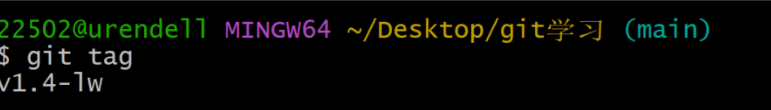

# 2.6Git 基础-打标签

## 列出标签

`git tag` 列出已有的标签

`git tag -l"v1.8.5*"`专门查看这个的标签信息

## 创建标签

### 轻量标签

一个不会改变的分支，它只是某个特定提交的引用

### 附注标签

而附注标签是储存在Git数据库中的一个完整对象，他们是可以被校验的，其中包含打标签者的名字、电子邮件地址、日期事件

### 创建附注标签

`git tag -a v1.4 -m "my version 1.4"`

使用`git show` 查看标签信息和对应的提交信息

## 创建轻量标签

`git tag v1.4-lw`

### 后期打标签

`git tag -a v1.2 9fceb02`

### 共享标签

默认情况下，git push命令并不会传送变迁到远程仓库服务器上，在创建完标签后必须**显式地**推送标签到共享服务器上

`git push origin <tagname>`

## 删除标签

`git tag -d <tagname>`移除本地标签

`git push origin --delete <tagname>` 移除云端标签

## 检出标签

查看某个标签所指向的文件版本，可以使用`git checkout` 命令